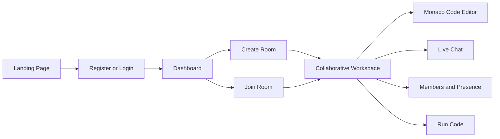
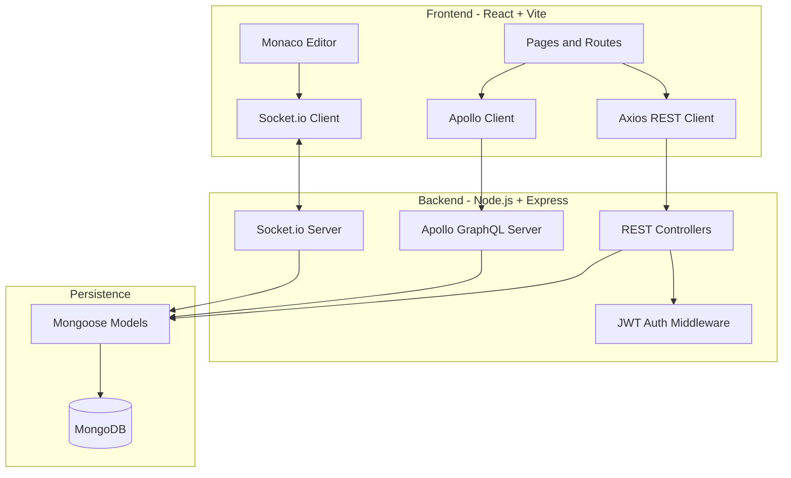

# CodeCollab

<div align="center">

**A full-stack real-time collaborative coding platform for teams, classrooms, and interview practice.**


</div>

## Overview

CodeCollab lets developers create private coding rooms, invite collaborators, edit code together in real time, chat inside the room, and track active participants. It combines a React/Vite frontend with a Node.js backend, MongoDB persistence, GraphQL queries, REST APIs, and Socket.io-powered live collaboration.

## Product Preview



## Architecture



## Features

| Area | What CodeCollab Provides |
| --- | --- |
| Authentication | Secure registration and login with bcrypt password hashing and JWT-based sessions. |
| Dashboard | Room discovery, room creation, search, collaboration stats, and recent activity. |
| Real-time editor | Monaco Editor workspace with synchronized code changes across connected users. |
| Presence | Join/leave events, active member list, cursor coordinates, and typing indicators. |
| Chat | Room-level messaging delivered instantly through Socket.io. |
| Authorization | Admins and room creators can delete rooms; regular developers can join and collaborate. |
| APIs | REST routes for auth/profile workflows and GraphQL for room/stat queries. |
| Code runner | Mock compiler terminal for language-aware run feedback during collaboration. |

## Tech Stack

| Layer | Tools |
| --- | --- |
| Frontend | React 19, Vite, React Router, Monaco Editor, Apollo Client, Axios, Socket.io Client |
| Backend | Node.js, Express, Apollo Server, Socket.io, JWT, bcryptjs |
| Database | MongoDB with Mongoose ODM |
| Developer tooling | npm workspaces-style scripts, concurrently, nodemon, ESLint |

## Project Structure

```text
CodeCollab/
|-- backend/
|   |-- config/              # MongoDB connection
|   |-- controllers/         # Auth, compiler, room, and user controllers
|   |-- graphql/             # GraphQL type definitions and resolvers
|   |-- middleware/          # JWT authentication middleware
|   |-- models/              # Mongoose schemas
|   |-- routes/              # REST API routes
|   |-- utils/               # Code runner helpers
|   |-- package.json
|   `-- server.js            # Express, Socket.io, and Apollo setup
|
|-- frontend/
|   |-- public/              # Static assets
|   |-- src/
|   |   |-- assets/          # App visuals
|   |   |-- components/      # Navbar, toast, shared UI
|   |   |-- context/         # Auth and socket providers
|   |   |-- pages/           # Landing, auth, dashboard, room, profile
|   |   |-- services/        # REST and GraphQL clients
|   |   |-- App.jsx
|   |   |-- App.css
|   |   `-- main.jsx
|   |-- package.json
|   `-- vite.config.js
|
|-- package.json             # Root scripts
`-- README.md
```

## Getting Started

### Prerequisites

- Node.js 18 or newer
- npm
- MongoDB installed locally or a MongoDB Atlas connection string

### Environment Variables

Create `backend/.env` and add:

```env
PORT=5000
MONGODB_URI=your_mongodb_connection_uri_here
JWT_SECRET=your_jwt_secret_key_here
```

### Install Dependencies

From the project root:

```bash
npm run install-all
```

### Run the App

```bash
npm run dev
```

| Service | URL |
| --- | --- |
| Frontend | `http://localhost:5173` |
| Backend API | `http://localhost:5000` |
| GraphQL endpoint | `http://localhost:5000/graphql` |

## Available Scripts

| Command | Description |
| --- | --- |
| `npm run install-all` | Installs root, backend, and frontend dependencies. |
| `npm run dev` | Runs backend and frontend together. |
| `npm run backend` | Starts only the backend development server. |
| `npm run frontend` | Starts only the Vite frontend server. |
| `npm run build --prefix frontend` | Builds the frontend for production. |
| `npm run lint --prefix frontend` | Runs frontend linting. |

## Verification Checklist

- Register two users with different roles.
- Log in from two browser windows and join the same room.
- Type in the editor and confirm changes sync instantly.
- Send room chat messages and confirm both users receive them.
- Check member presence, cursor updates, and typing indicators.
- Confirm only an admin or room creator can delete a room.

## Repository Notes

- Generated folders such as `node_modules/` and `frontend/dist/` are intentionally ignored.
- Secret files such as `.env` are intentionally ignored and should not be committed.
- Commit `package-lock.json` files so installs stay consistent across machines.

